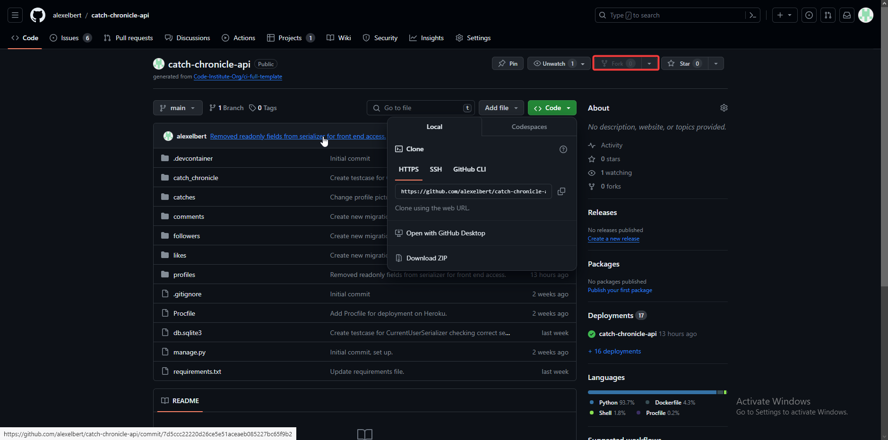
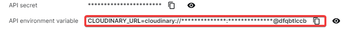
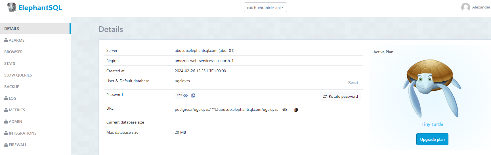
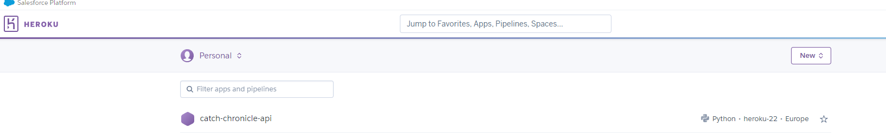
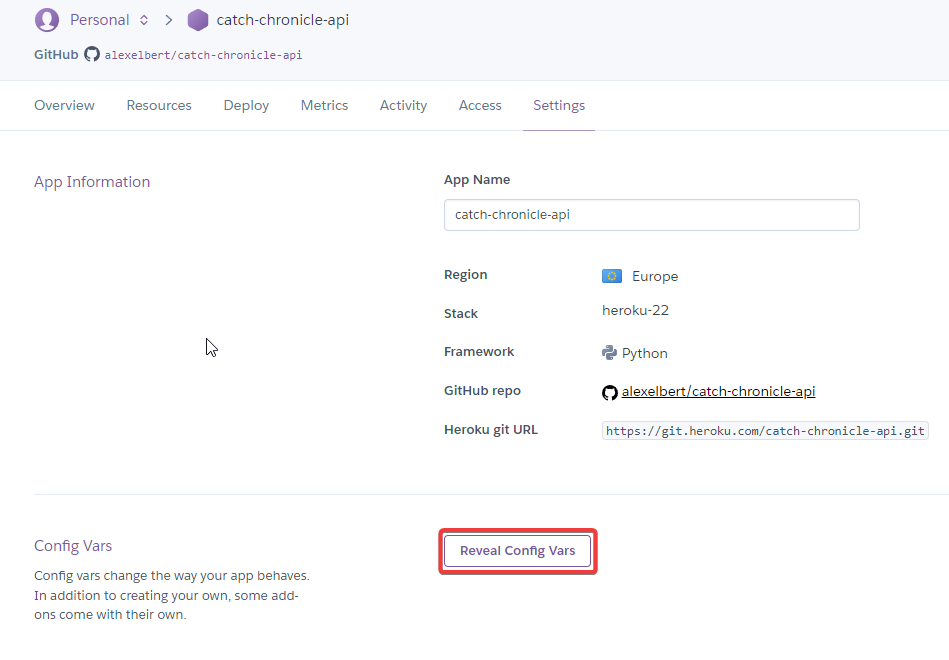
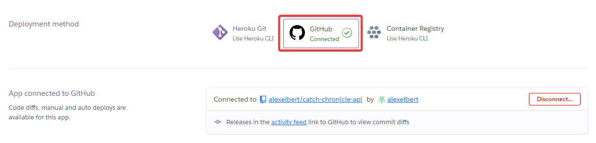
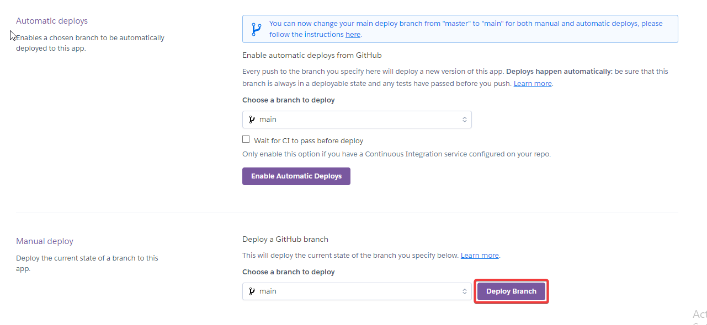
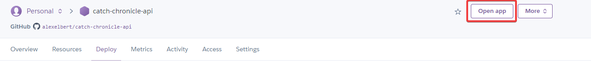
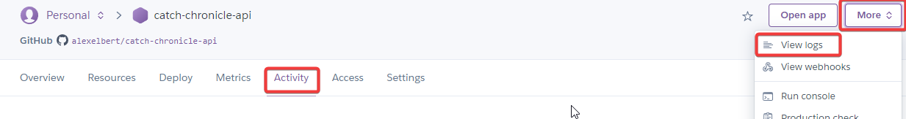

# Catch Chronicle API

The **Catch Chronicle API** is a Django Rest Framework API for social media applications with a focus on catch recording and geolocation data. The API is primarily used for the [Catch Chronicle](https://github.com/alexelbert/catch-chronicle) app, a social media app for logging and sharing fishing catches, but could also be adapted for other social media applications with focus around logging fish catches.

The API is designed to support uploading catch data including geolocation data and provides endpoints for social media interactions between users.

Key features:

- User authentication
- Endpoints for logging catches
- Store geolocation data with catches
- Endpoints for user interactions (Profiles, Likes, Comments, Followers)

The deployed API can be found here: [Catch Chronicle API](https://catch-chronicle-api-d205d9d4b14c.herokuapp.com)

### Data Models

The following custom models have been implemented in the project. The relationship between these models is outlined in the mermaid class diagram below.

[](https://mermaid.live/edit#pako:eNq9VU1v2zAM_SuGjlt72NWHHdYiQLHuA2t6MxAoEmMLkURDpucFRf77aMtplNQOWmCdD7as9ySSjxT1JBRqELlQVjbNrZFlkK7wGT-PDYSsEJ8KkV1ffx5HPwNujIUszyrZzPA-8OhGkqqYhZ2_SEPnwBMTu2AILlEXaC12DOTZZhi-kmyakQ86W-8urLk32z6u0vy-6Md3JLMxSpJBz_QACo4rYtjzUT6LNk0cXTjdc8jM4MtTnOifjw8UjC-zlqe9dPASASeNjdP7dKMxg-lePzwskV8LA1b3KYOQoLeSYGnciKoA_K9XkmYpba1fUm4qGSJ85u4S_lAE1gYnF1iMaifgnZPlaK2O8axqo6gN6c6Pv-4jZSMVrBG3qzbYKZw6QwRhDja-oeFcHAknig65TPVcYABT-q-we3cxlaznpTH9cHJZU4MyhwI7wxxQhTp1iLlO2oh2HFlFc6gFX1L12iwuLMox95YxajXMoOjLc_goERk3HWXH6lYn8ifuPNfKaS7jUf2v2UwMqL6U7vTk8VDoiV2bcPrQ7f6d18nqQ_OcsNu3q3exOcgwYTDtvTOG-4b4NrtJZ0q2X9Gunm5TpyyeTlhfEC1IPx6_ZsX2jsKJK-EgcFvWfN8O7heC65OLV-Q81DJsC1H4PfNkS_iw80rkFFq4ErFuxuv5MAnaEIZv4_3df_Z_ASa1Y6s)

#### Profile Model

The Profile model represents user profiles with a one-to-one relationship with the default User model. It provides additional fields for uploading a profile picture *profile_picture*, providing a *name*, *bio*, *location*, *facebook_url*, *twitter_url*, *instagram_url* . Profiles are automatically created when a new user is created.

#### Catch Model

The Catch model provides fields for uploading image file and providing metadata, such as *caption*, *species*, *method*, an *image*, and *latitude*, *longitude* for geolocation data.

Together with the User model, the Catch model makes up the core of the application. All other models are related to either the Catch model or the User model, or both.

#### Like and Comment Models

The Like and Comment model are both related to the Catch and User model. It allows users to like or comment on catches. While Like instances can only be created or deleted. Comments can be updated because of a provided *content* field from the Comment model.
 
#### Follower Model

The Follower model establishes a "following" relationship between two User instances. The *owner* field of the Follower model represents the user who is initiating the follow, while the *followed* field represents the user who is being followed.

## Technologies Used

### Frameworks and Languages

The API is built with [Django Rest Framework](https://www.django-rest-framework.org/), a [Django](https://www.djangoproject.com/) based toolkit for building APIs with Python.

### Additional Python Packages

- [gunicorn](https://pypi.org/project/gunicorn/): WSGI server used for deployment 
- [psycopg2](https://pypi.org/project/psycopg2/): PostgreSQL database integration
- [dj-database-url](https://pypi.org/project/dj-database-url/): Django database management 
- [cloudinary](https://pypi.org/project/cloudinary/): Cloudinary integration
- [django-cloudinary-storage](https://pypi.org/project/django-cloudinary-storage/): Using Cloudinary as Django file storage
- [django-allauth](https://pypi.org/project/django-allauth/): Advanced authentication and user management for Django 
- [dj-rest-auth](https://pypi.org/project/dj-rest-auth/): Advanced DRF authentication (Version 2.2.8 or older has to be used in order for the custom UserSerializer functionality to work)
- [django-cors-headers](https://pypi.org/project/django-cors-headers/): Handle Cross-Origin Resource Sharing in Django
- [django-filter](https://pypi.org/project/django-filter/): Provides filtering with URL parameters for querysets
- [django-tagulous](https://pypi.org/project/django-tagulous/): Tagging library for Django
- [coverage](https://pypi.org/project/coverage/): Analyzing test coverage

### Other Software

- [GitHub](https://github.com/) is used to store all project files in the [repository](https://github.com/alexelbert/catch-chronicle-api)
- [GitHub Issues](https://github.com/alexelbert/catch-chronicle-api/issues) have been used for Agile methodology by assigning user stories to issues and using labels to organize user stories.
- [Heroku](https://heroku.com/) is used to [deploy the API](#deployment).
- [ElephantSQL](https://www.elephantsql.com/) is used for the projects PostgreSQL database.
- [Cloudinary](https://cloudinary.com/) is used to store media files and for uploading image files.
- [Mermaid](https://mermaid.js.org/syntax/classDiagram.html) was used to create the class diagram.
- [Postman](https://www.postman.com/) has been used for testing all API endpoints and for generating [API endpoint documentation](https://documenter.getpostman.com/view/29756179/2s9YCBsopC).
- [Visual Studio Code](https://code.visualstudio.com) was used for writing code.

## Testing

[All project testing have been documented here](docs/testing/TESTING.md).

## Deployment

The project was deployed to [Heroku](https://heroku.com). A live version of the API can be found at https://catch-chronicle-api-d205d9d4b14c.herokuapp.com.

The necessary steps to deploy the project are:
1. Clone or fork the repository. For forking it, go to https://github.com/alexelbert/catch-chronicle-api, click on `Fork` and follow the instructions. For cloning the repository run `git clone https://github.com/alexelbert/catch-chronicle-api.git` in your terminal.

    

2. Create an account at https://cloudinary.com and get your Cloudinary URL from the dashboard by copying it.

    

3. Create a PostgreSQL database, for example at https://www.elephantsql.com/. Create an account and after login in, click on `Create new instance` and follow the instructions. Click on your newly created database and get the URL from the database details.

    

4. Create an account at https://heroku.com and login. Then, start a new app from the [Heroku dashboard](https://dashboard.heroku.com) by clicking on `New` and then on `Create new app`.

    

5. Give your app an available name and choose your region (US or Europe).

6. After creating your app, go to the *Settings* tab and click on `Reveal Config Vars` in the *Config Vars* section.

    

7. Now, one by one, add the following config vars:

    | Name                  | Value                                   |
    | --------------------- | --------------------------------------- |
    | CLIENT_ORIGIN         | \<your client url\>                     |
    | CLIENT_ORIGIN_DEV     | \<your development environment url\> ** |
    | CLOUDINARY_URL        | \<Your cloudinary url\>                 |
    | DATABASE_URL          | \<Your database url\>                   |
    | DISABLE_COLLECTSTATIC | 1                                       |
    | SECRET_KEY            | \<some random string\>                  |

    \* Paste the URL without 'https://' or a trailing slash!

    \*\* E.g. "http://localhost:3000" for building a React front end app in a local environment. This may be different depending on your IDE.

8. Click on the *Deploy* tab and connect the Heroku app to your GitHub repository.

    

9. Scroll down and choose the branch you want to deploy in the *Manual deploy* section. Now click on `Deploy Branch` for the first deployment of the application.

    

10. After deployment click on `Open app` to open your deployed app.

    

11. In case you run into any issues you can access logs by clicking on `More` and then `View logs` or you can check the *Activity* tab for debugging.

    

## Credits

### Sources

The initial setup and the general structure of the project are based on the instructions from the Code Institute *Django Rest Framework* walkthrough project ([source code](https://github.com/Code-Institute-Solutions/drf-api/)). The basic structure of the Profile, Like, Comment, and Follow models (and their serializers), as well as the filtering functionality has been adopted from the walkthrough project and adjusted to fit the specific circumstances of the project.

Additionally, I made extensive use of the following documentation:

- [Django documentation](https://www.djangoproject.com/)
- [Django Rest Framework documentation](https://www.django-rest-framework.org/)
- [django-filter documentation](https://django-filter.readthedocs.io/en/stable/)

Individual documentation pages that have been used are referenced in the code.

All other sources used during development are listed here (all code from these sources has been thoroughly reviewed, understood and adapted to the specific circumstances of this project). References to the sources can also be found in the code.

- Conditionally truncate a string in Python: https://stackoverflow.com/a/52279347
- Print test ID for each test: https://docs.python.org/3/library/unittest.html#unittest.TestCase.id
- Mock a file upload for testing: https://stackoverflow.com/a/20508621
- Avoiding TransactionManagementError in unit tests from: https://stackoverflow.com/a/23326971

### Acknowledgements

- I would like to thank my Code Institute mentor Mo for his advice and support.
- I would like to thank my girlfriend Sabrina for moral support and advice.